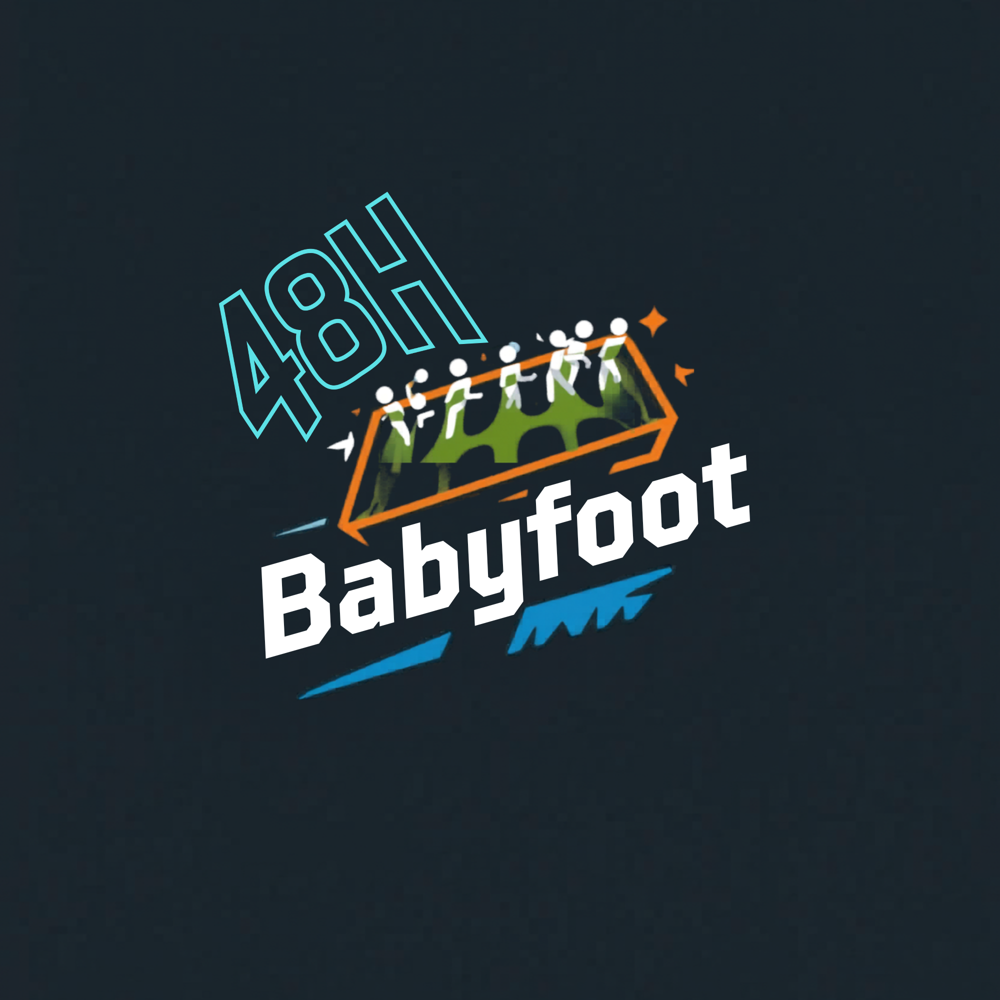

<table width="100%" border="0" cellspacing="0" cellpadding="0">
<tr>
<td align="left"><h1>Challenge 48h - Ynov Toulouse 2026</h1></td>
<td align="right"></td>
</tr>
</table>

> Ce repository contient les ressources ainsi que la structure à reprendre lors du challenge 48h Ynov Toulouse 2026.

Cette template de README est un guide pour vous aider afin de structurer votre rendu de projet. N'hésitez pas à l'adapter ou surtout à le compléter avec des sections supplémentaires si nécessaire.

## Contexte

Et si on réinventait l’expérience babyfoot à Ynov ? L’objectif de ce hackathon est de moderniser et digitaliser l’usage des babyfoots présents dans le Souk pour créer un service next-gen, pensé pour près de 1000 étudiants !

Que ce soit via des gadgets connectés, un système de réservation intelligent, des statistiques en temps réel ou des fonctionnalités robustes pour une utilisation massive, nous cherchons des solutions innovantes qui allient créativité et technologie.

Toutes les disciplines sont invitées à contribuer : Du Dev, de l'Infra, de la Modélisation 3D, de l'IA/Data, chaque idée compte pour rendre le babyfoot plus fun, plus pratique et plus connecté.

Votre mission : transformer le babyfoot classique en expérience high-tech pour Ynov !

Bienvenue dans le Hackathon Ynov Toulouse 2026 !

Vous représentez une sous-équipe de 6 à 8 personnes, votre objectif, collaborer avec les autres sous-équipes dans votre "Entreprise" pour créer un seul et projet commun, qui sera votre rendu final. Vous devrez faire preuve de créativité, d'innovation, et de travail en équipe pour relever ce défi.

> Retrouvez vos guidelines techniques dans le fichier [SPECIFICATIONS.md](./SPECIFICATIONS.md).

---

> P.S C'est un projet de groupe, dans vos sous groupes, c'est un effort collectif (Bachelors 1/2 et Bachelors 3). Travaillez ensemble pour un seul et même projet au nom de votre équipe toute entière. Les guidelines sont là pour vous aider, pas pour vous diviser. Profitez de ce moment pour apprendre à travailler ensemble, partager vos compétences, et créer quelque chose d'unique.

## Entreprise

Nom: Entreprise TEMPLATE CORPORATION

### Equipe 1

- Eric PHILIPPE (M2 WEBDEV)
- Prenom NOM (B1 INFO)
- Prenom NOM (B2 INFO)
- Prenom NOM (B3 INFO)
- Prenom NOM (B3 INFO)
- Prenom NOM (B3 INFO)

### Equipe 2

- Prenom NOM (B1 INFRA)
- Prenom NOM (B1 IADATA)
- Prenom NOM (B2 INFO)
- Prenom NOM (B2 INFO)
- Prenom NOM (B3 INFO)
- Prenom NOM (B3 INFO)
- Prenom NOM (B3 INFO)

### Equipe 3

- Prenom NOM (B1 INFO)
- Prenom NOM (B1 INFO)
- Prenom NOM (B2 INFO)
- Prenom NOM (B2 INFO)
- Prenom NOM (B3 INFO)
- Prenom NOM (B3 INFO)
